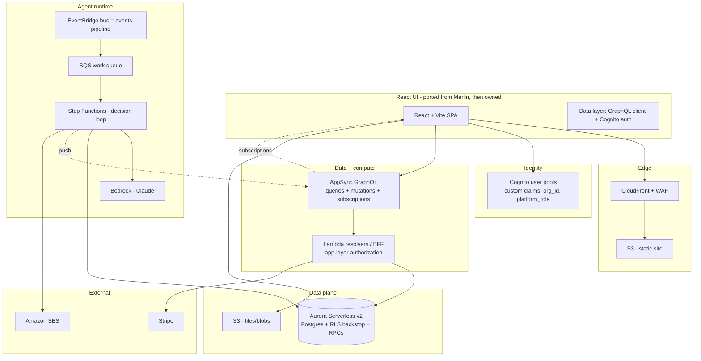

# Stratos — Architecture (plan of record)

**Status:** 🟠 Founding spec · 2026-07-02 · nothing deployed yet
**Owner:** JB
**One-liner:** A fully AWS-native building-operations platform with the same
functionality and UI as Merlin, built from scratch on AWS managed services only.

---

## 1. What this is (and is not)

Stratos is a **greenfield** rebuild driven by a procurement mandate for a
**fully AWS-native managed stack** — no Supabase software, no PostgREST.

**Independence is a hard rule:**

- ❌ No shared database, no sync, no CDC, no live dependency on Merlin.
- ❌ No shared deploy, secrets, or infra.
- ✅ Merlin is a **reference spec** (functionality + UI) and a **one-time data
  source** (imported once at bootstrap, then the cord is cut).

Reusing Merlin's UI source, DB schema model, and test suites as a **one-time
starting point is allowed** — copying is not coupling. After bootstrap, Stratos
owns everything outright.

---

## 2. Principles

1. **AWS-native managed services only** for platform infrastructure. The only
   non-AWS pieces are external business integrations with no AWS equivalent
   (Stripe for payments).
2. **Authorization in the application layer** (AppSync/Lambda) — the mandated
   shape — **with RLS kept in the database as a backstop.** Defense in depth.
3. **Same UI.** Port Merlin's React SPA; swap only the data layer.
4. **Same domain model.** Reuse Merlin's hard-won schema as a clean baseline;
   do not re-author it from nothing.
5. **Parity is proven, not asserted.** The ported cross-tenant leak suite and
   E2E journeys are the definition of "done."
6. **Everything is IaC** (Terraform). Reproducible + per-client stampable.

---

## 3. Target architecture

---

## 4. AWS service map

| Concern | Merlin (today) | **Stratos (AWS-native)** | Notes |
| --- | --- | --- | --- |
| Frontend hosting | S3 + CloudFront | **S3 + CloudFront + WAF** | Same edge model |
| Auth | GoTrue | **Cognito** | Custom claims carry `organization_id`, `platform_role` |
| Data API | PostgREST | **AppSync (GraphQL)** | Flexible query + built-in Cognito authz |
| Realtime | Supabase Realtime | **AppSync subscriptions** | Same service as data API |
| Compute | Lambda | **Lambda** | Resolvers + BFF logic |
| Database | Supabase Postgres | **Aurora Serverless v2 (Postgres)** | RLS kept as backstop; RPCs kept |
| Object storage | Supabase Storage | **S3** | Presigned URLs |
| Scheduling | EventBridge | **EventBridge Scheduler → Lambda** | Cron equivalents |
| Agent orchestration | PG cron + `events` table | **Step Functions + EventBridge + SQS** | Durable, observable, retryable |
| LLM | Bedrock | **Bedrock (Claude)** | Region-pinned inference profiles |
| Email | Resend | **Amazon SES** | SPF/DKIM/DMARC |
| Secrets | Secrets Manager | **Secrets Manager** | Same |
| Observability | Sentry | **CloudWatch + X-Ray** | Native tracing/alarms |
| IaC | Terraform | **Terraform** | Per-client stampable modules |

**External (no AWS equivalent):** Stripe (payments).

---

## 5. The two decisions that dominate the build

### 5.1 Authorization: app-layer + RLS backstop

No PostgREST means the SPA cannot talk to the DB directly. Every read/write goes
through **AppSync → Lambda resolvers**, and org/location/contract/platform-admin
scoping becomes **application code**.

**We keep RLS enabled in Aurora anyway** (RLS is a Postgres feature, fully
allowed) as a safety net: resolvers set the Cognito-derived claims into the DB
session, so the same policies still fire. App-layer authz is the mandated shape;
RLS is the last line of defense. See
[`docs/architecture/authorization-and-claim-bridge.md`](docs/architecture/authorization-and-claim-bridge.md).

### 5.2 Data API: AppSync resolver strategy

AppSync restores the flexible querying the SPA relies on **and** replaces
realtime in one managed service. Resolvers reach Aurora via:

- **RDS Data API** (managed, no connection pooling) for straightforward CRUD, or
- **Lambda resolvers** for complex logic + calling the ported RPCs.

This resolver surface (≈100 tables of reads/writes) **is the bulk of the
project** — budgeted as the rebuild, not a detail.

---

## 6. Components

### 6.1 Frontend (ported)

React + Vite SPA copied from Merlin, then owned. Only the data layer changes:
`supabase-js` → a GraphQL client (AWS Amplify or urql/Apollo) + Cognito auth.
Merlin's `queries/*.ts` React Query hooks are the seam that makes this a client
swap, not a component rewrite. i18n, routing, components carried over.

### 6.2 Auth (Cognito)

User pools with custom attributes for `organization_id` and `platform_role`.
One-time user import from Merlin (`auth.users` → Cognito, force password reset).
JWT claims mapped into the DB session for the RLS backstop.

### 6.3 Database (Aurora Serverless v2, Postgres)

Merlin's schema is **snapshotted into a clean `V1_baseline.sql`** (fresh
migration history — greenfield), preserving the domain model + the ~100
`SECURITY DEFINER` RPCs + RLS policies. Evolves forward independently.

### 6.4 Agent runtime (the deliberate upgrade)

Merlin's `events` table + Postgres cron becomes native:

- **EventBridge** is the events bus (devices / webhooks / simulator publish here).
- **SQS** buffers work.
- **Step Functions** runs the durable agent decision loop (act/ask/skip), calls
  **Bedrock**, writes `agent_runs` + action tables, and pushes results to the UI
  via an AppSync mutation/subscription. Spend guard is a state in the machine.

See [`docs/architecture/agent-runtime.md`](docs/architecture/agent-runtime.md).

### 6.5 Storage (S3)

Buckets per concern (ticket photos, branding, CMS). Presigned URLs for
upload/download. Access scoped by key prefix + resolver checks.

### 6.6 Scheduling (EventBridge Scheduler)

Merlin's crons (SLA sweeps, billing sync, push dispatch, retention) become
EventBridge schedules targeting Lambda, gated by IAM (no shared cron secret
needed — invocation is AWS-authenticated).

---

## 7. Environments & deployment

- **Terraform**, one reusable module set, instantiated per environment
  (`dev`, `staging`, `prod`) and, later, **per-client isolated stacks**
  (own VPC/DB/domain/region) — residency satisfied per deployment.
- State in S3 with native locking, one key per env/client.
- CI/CD via GitHub Actions → AWS OIDC (no long-lived keys). Manual-approve gate
  on prod.

---

## 8. One-time data seed (no sync)

Bootstrap only, then sever. See [`docs/data-seed/`](docs/data-seed/).

| Source (Merlin) | Target (Stratos) | Method |
| --- | --- | --- |
| Postgres tables | Aurora | `pg_dump` → transform → restore |
| `auth.users` | Cognito | Bulk CSV import, force password reset |
| Storage blobs | S3 | One-time API copy |

---

## 9. Acceptance (parity gate)

Stratos reaches "same functionality" when the **ported cross-tenant leak suite**
and the **E2E journeys** pass against the AWS stack. These run in CI and block
release. See [`docs/parity/`](docs/parity/).

---

## 10. Build sequence

1. **Foundation** — Terraform baseline, Aurora + `V1_baseline.sql`, RLS proven
   from injected claims.
2. **Identity** — Cognito + claim bridge; prove one policy + one RPC end-to-end.
3. **Vertical slice** — one domain (events/asks) fully through AppSync:
   query + mutation + subscription + authz. Validates the pattern before scaling.
4. **Parity harness** — port leak suite + E2E; wire as CI gates.
5. **Domain-by-domain** — build out the resolver surface; port UI data hooks.
6. **Agent runtime** — EventBridge + SQS + Step Functions + Bedrock.
7. **Storage + email + billing** — S3, SES, Stripe.
8. **Data seed + launch** — one-time import, smoke, cut over DNS.

---

## 11. Risks

| Risk | Mitigation |
| --- | --- |
| App-layer authz leaks tenant data | RLS backstop + leak suite as hard CI gate |
| AppSync resolver sprawl (≈100 tables) | Budget it as the core build; codegen where possible |
| Cognito claim mapping errors | Vertical-slice proof before scaling |
| Scope creep into UI rewrite | UI is ported, not rewritten (no mandate benefit) |
| Aurora cost at low scale | Serverless v2 scale-to-low; review at real load |

---

## 12. Non-goals

- No sync or shared runtime with Merlin.
- No UI re-implementation from scratch (port it).
- No microservices — Lambda + AppSync + Aurora monolith is right at this scale.
- No multi-region active-active initially (per-client stack covers residency).
