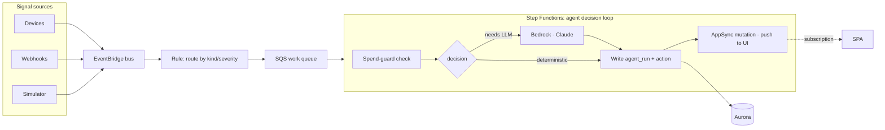

# Agent runtime — EventBridge + SQS + Step Functions

**Status:** 🟢 First slice landed · 2026-07-02

> **Built:** the ingest + decision path is real and test-covered.
> - **DB** (`db/migrations/002_agent_runtime.sql`) — per-org hourly spend budget
>   plus the system write paths `agent_run_allowed` (spend guard),
>   `record_agent_run` (decision log), and `agent_raise_ask`, all SECURITY
>   DEFINER / owned by the BYPASSRLS `stratos_auth` role (the agent has no
>   Cognito identity, so it can't use the claim bridge).
> - **Worker** (`api/src/agent-worker.mjs` + pure `agent-core.mjs`) — normalizes
>   SQS/EventBridge/Step Functions inputs, applies the deterministic policy
>   (critical→act, warning→ask, info→skip), enforces the spend guard on
>   LLM-backed decisions, records the run, and raises operator asks. Proven by
>   `api/test/agent.test.mjs` on PGlite.
> - **Reasoner** (`api/src/bedrock.mjs`) — the `act` path invokes a pluggable
>   reasoner behind the spend guard. Production uses an Amazon Bedrock adapter
>   (Claude via `InvokeModel`, SDK lazy-loaded); tests inject a fake. The
>   returned rationale + cost are recorded on the run, so the guard meters real
>   spend. Worker role gets `bedrock:InvokeModel`.
> - **Infra** — `modules/eventbridge` (custom bus + routing rule + SQS work
>   queue with a DLQ + SQS→worker mapping), `modules/lambda` (the worker
>   function + Bedrock permission), `modules/stepfunctions` (a Standard state
>   machine: a retryable AgentTick task → Choice on the decision).
>   `terraform validate` passes.
>
> **Not yet built:** the AppSync push-to-UI mutation after a write (so the SPA
> updates live from an agent action), splitting the spend guard into a discrete
> Step Functions state, and token-accurate Bedrock cost accounting (currently a
> per-invoke approximation).

The agent runtime is **event-driven and durable by design**, built entirely on
native AWS primitives so every decision is retryable, observable, and cost-gated.

---

## Components

| Concern | Service |
| --- | --- |
| Canonical signal layer | **EventBridge bus** + an `events` table of record in Aurora |
| Time-based triggers | **EventBridge Scheduler** + event-driven rules |
| Decision loop | **Step Functions** state machine |
| Decision log | Aurora `agent_runs` |
| Per-agent action records | Aurora action tables |
| LLM call | **Bedrock** invoke (a state in the machine) |
| Spend guard | a **guard state** before the Bedrock invoke |

---

## Flow

## Why Step Functions over a cron

- **Durable & retryable** — a stuck tick can't silently stall the whole loop;
  each step retries with backoff and surfaces failures to CloudWatch.
- **Observable** — every execution is a visual trace; no guessing what an agent
  did on a given tick.
- **Spend guard as a first-class state** — the per-org hourly/daily Bedrock cost
  cap gates the Bedrock invoke explicitly; a breach short-circuits to `skip`.
- **Fan-out** — EventBridge rules route by `kind`/`severity` to different agents
  without a monolithic poller.

## Events model

- **EventBridge** is the transport (at-least-once, decoupled ingest).
- Aurora keeps an `events` table of record for query/audit and for the UI's
  event feed, written by the resolver/consumer.
- Idempotency via `external_id` to dedupe retry-prone sources.

## Scheduling (non-agent crons)

SLA sweeps, billing sync, push dispatch, retention prune → **EventBridge
Scheduler** targeting Lambda, IAM-authenticated (no shared cron secret).

## Open questions

- Standard vs Express Step Functions (cost/latency per tick volume).
- Whether high-frequency simulator ticks go direct SQS→Lambda (cheaper) and only
  real decisions enter Step Functions.
- EventBridge Pipes to connect the bus → SQS → target with less glue.
