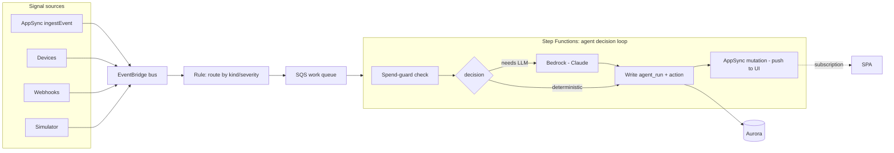

# Agent runtime — EventBridge + SQS + Step Functions

**Status:** 🟢 First slice landed · ingest front door + push-to-UI wired · live-smoke-tested · 2026-07-02

> **Built:** the ingest + decision path is real and test-covered.
> - **Front door** (`api/src/event-emitter.mjs`) — `Mutation.ingestEvent` records
>   the event, then emits a `stratos.api` signal onto the EventBridge bus so the
>   agent evaluates it (best-effort: a bus hiccup never fails the write). The
>   routing rule forwards it to SQS → the worker. The isolated VPC reaches
>   EventBridge through an interface endpoint (`modules/network`); the resolver
>   role gets `events:PutEvents` scoped to the bus. Covered by the emit-seam
>   tests in `api/test/resolver.test.mjs`.
> - **DB** (`db/migrations/002_agent_runtime.sql`) — per-org hourly spend budget
>   plus the system write paths `agent_run_allowed` (spend guard),
>   `record_agent_run` (decision log), and `agent_raise_ask`, all SECURITY
>   DEFINER / owned by the BYPASSRLS `stratos_auth` role (the agent has no
>   Cognito identity, so it can't use the claim bridge).
> - **Worker** (`api/src/agent-worker.mjs` + pure `agent-core.mjs`) — normalizes
>   SQS/EventBridge/Step Functions inputs, applies the deterministic policy
>   (critical→act, warning→ask, info→skip), enforces the spend guard on
>   LLM-backed decisions, records the run, and raises operator asks. Proven by
>   `api/test/agent.test.mjs` on PGlite.
> - **Reasoner** (`api/src/bedrock.mjs`) — the `act` path invokes a pluggable
>   reasoner behind the spend guard. Production uses an Amazon Bedrock adapter
>   (Claude via `InvokeModel`, SDK lazy-loaded); tests inject a fake. The
>   returned rationale + cost are recorded on the run, so the guard meters real
>   spend. Worker role gets `bedrock:InvokeModel`.
> - **Push to UI** (`api/src/appsync-publish.mjs`) — after recording a decision
>   the worker fans it out live to the SPA. AppSync only notifies subscribers on
>   a **mutation**, so the agent calls the IAM-only `publishAgentActivity` (a
>   NONE-data-source passthrough) with SigV4; `onAgentActivity(organizationId)`
>   subscribers receive it. AppSync now runs dual auth: Cognito (SPA) + AWS_IAM
>   (agent). The GraphQL URL is read at runtime from an SSM parameter (static
>   name → no lambda↔appsync module cycle). Publishing is **best-effort**: a
>   fan-out failure never fails the run (the decision is already durable).
>   Covered by the publish-seam tests in `api/test/agent.test.mjs`; the SPA feed
>   is `web/src/components/AgentActivityPanel.tsx` + `queries/useAgentActivity.ts`.
> - **Infra** — `modules/eventbridge` (custom bus + routing rule + SQS work
>   queue with a DLQ + SQS→worker mapping), `modules/lambda` (the worker
>   function + Bedrock permission + `APPSYNC_URL_PARAM`), `modules/appsync`
>   (dual auth, NONE publish resolver, SSM URL param, worker publish policy),
>   `modules/stepfunctions` (a Standard state machine: a retryable AgentTick task
>   → Choice on the decision). `terraform validate` passes.
>
> **Worker egress (resolved).** The VPC is isolated (no NAT). AppSync's GraphQL
> data plane has **no PrivateLink**, so the worker's push-to-UI (and Bedrock/SSM)
> egress rides an optional **NAT gateway** — `enable_nat` in `modules/network`,
> off by default to avoid idle cost, on for the live loop.
>
> **Live smoke test (2026-07-02).** Full apply (`enable_nat=true`,
> `enable_edge=false`) → migrate+seed → `PutEvents` a signal onto the bus:
> - ✅ warning → the worker consumed it (EventBridge → SQS → Lambda), raised an
>   operator ask in Aurora, and ran clean over NAT (no publish/egress errors,
>   DLQ empty) — the ingest→decide→DB→publish loop works end-to-end.
> - ⚠️ critical → the act path **reached** Bedrock over NAT (egress confirmed) but
>   the call returned `ResourceNotFoundException`: the account only exposes
>   *legacy* Claude models and lacks access to a current one. **Action:** enable
>   Bedrock model access for the `BEDROCK_MODEL_ID` default (a current inference
>   profile). The reasoner failure is now non-fatal — the act is still recorded
>   with a deterministic fallback rather than retrying to the DLQ.
>
> **Next:**
> - Enable Bedrock model access + re-verify the act path live.
> - Splitting the spend guard into a discrete Step Functions state.
> - Token-accurate Bedrock cost accounting (currently a per-invoke approximation).

The agent runtime is **event-driven and durable by design**, built entirely on
native AWS primitives so every decision is retryable, observable, and cost-gated.

---

## Components

| Concern | Service |
| --- | --- |
| Canonical signal layer | **EventBridge bus** + an `events` table of record in Aurora |
| Time-based triggers | **EventBridge Scheduler** + event-driven rules |
| Decision loop | **Step Functions** state machine |
| Decision log | Aurora `agent_runs` |
| Per-agent action records | Aurora action tables |
| LLM call | **Bedrock** invoke (a state in the machine) |
| Spend guard | a **guard state** before the Bedrock invoke |
| Synthetic load | **Simulator** Lambda on a scheduled rule (off by default) |

---

## Flow

## Why Step Functions over a cron

- **Durable & retryable** — a stuck tick can't silently stall the whole loop;
  each step retries with backoff and surfaces failures to CloudWatch.
- **Observable** — every execution is a visual trace; no guessing what an agent
  did on a given tick.
- **Spend guard as a first-class state** — the per-org hourly/daily Bedrock cost
  cap gates the Bedrock invoke explicitly; a breach short-circuits to `skip`.
- **Fan-out** — EventBridge rules route by `kind`/`severity` to different agents
  without a monolithic poller.

## Events model

- **EventBridge** is the transport (at-least-once, decoupled ingest).
- Aurora keeps an `events` table of record for query/audit and for the UI's
  event feed, written by the resolver/consumer.
- Idempotency via `external_id` to dedupe retry-prone sources.

## Simulator (`api/src/simulator.mjs`)

A scheduled Lambda that exercises the whole loop without real devices. Each tick
it picks a real seeded device, records a synthetic `events` row, and `PutEvents`
a signal onto the bus — the **same front door** the resolver uses on
`ingestEvent`, so the worker path is identical to production. Severity is
weighted (~10% `critical`, ~30% `warning`, else `info`), so the act path
(Bedrock) fires occasionally rather than every tick.

- **Off by default** (`enable_simulator = false`) → deploys nothing, costs
  nothing.
- Tunable via `simulator_schedule` (default `rate(5 minutes)`) and
  `simulator_signals_per_tick` (default `1`).
- **Cost:** the simulator itself is ~free (scheduled rule fires free, Lambda +
  PutEvents within free tier). It adds only ~**$1–3/mo** of Bedrock on the
  critical share; the deployed stack's Aurora (~$43/mo) and NAT (~$32/mo)
  dominate and exist regardless. It is a SYSTEM actor (DB master, direct insert,
  no claim bridge), reusing the shared Lambda role — no new IAM.

## Scheduling (non-agent crons)

SLA sweeps, billing sync, push dispatch, retention prune → **EventBridge
Scheduler** targeting Lambda, IAM-authenticated (no shared cron secret).

## Open questions

- Standard vs Express Step Functions (cost/latency per tick volume).
- Whether high-frequency simulator ticks go direct SQS→Lambda (cheaper) and only
  real decisions enter Step Functions.
- EventBridge Pipes to connect the bus → SQS → target with less glue.
