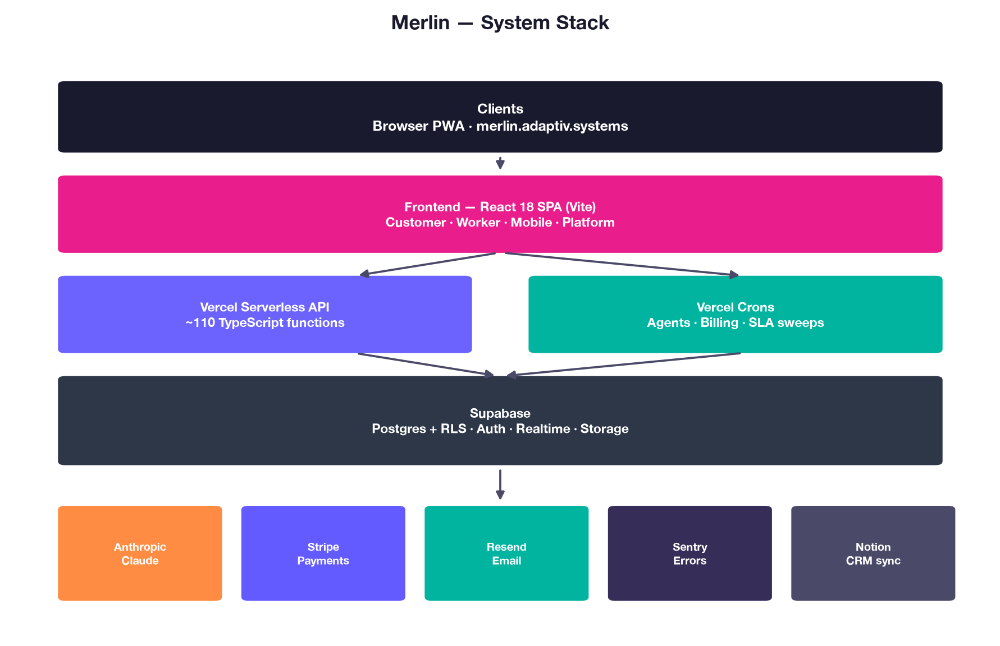
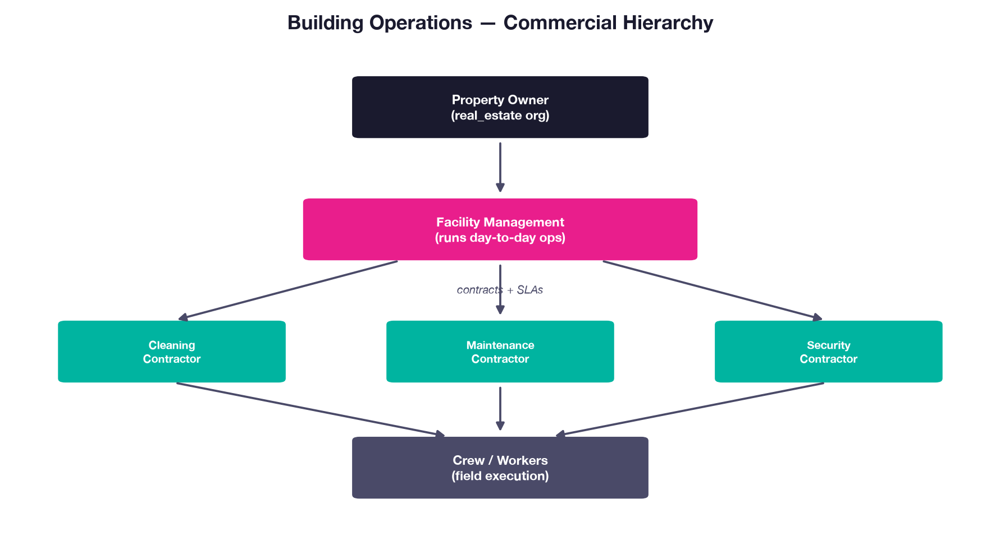
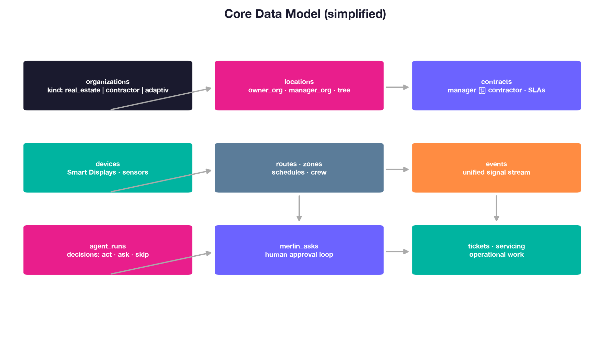
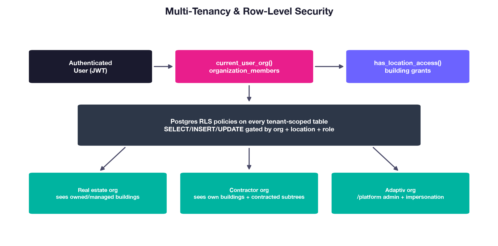
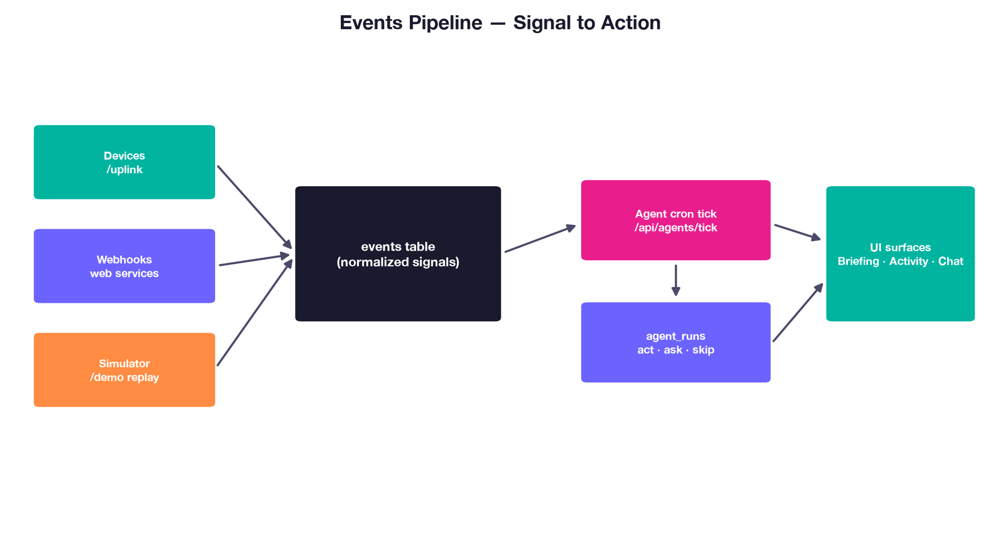
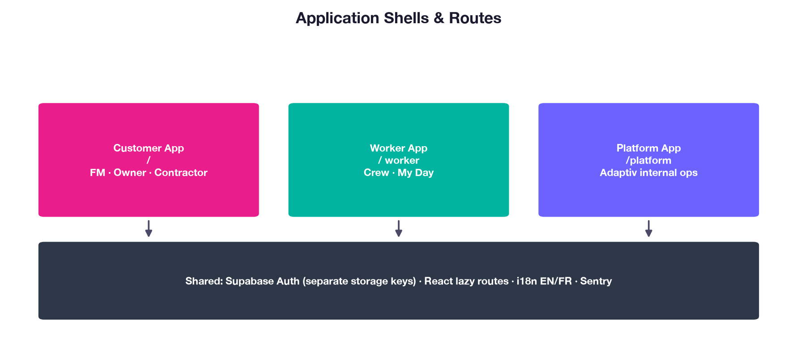
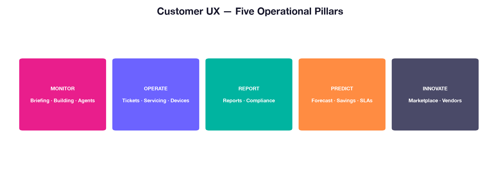

# Merlin — Technical Appendix

**Adaptiv Systems · Investor / due-diligence package**  
**Version:** 1.0 · **June 2026** · **Confidential**

**Production:** [merlin.adaptiv.systems](https://merlin.adaptiv.systems) · **Mobile:** [mobile.adaptiv.systems](https://mobile.adaptiv.systems)

---

## Document map

| Section | Topic                                                       |
| ------- | ----------------------------------------------------------- |
| 1–8     | Architecture (stack, tenancy, data model, agents, surfaces) |
| 9       | Engineering process & CI                                    |
| 10      | Test strategy                                               |
| 11      | Security & subprocessors                                    |
| 12      | Scalability (~100 tenants)                                  |
| 13      | Known gaps (honest)                                         |
| 14      | Governance policies                                         |
| 15      | 90-day engineering priorities                               |

**Regenerate:** `python3 scripts/generate-technical-appendix.py` → `Merlin-Technical-Appendix.docx` + `.pdf`

---

## 1. Executive summary

Merlin is Adaptiv Systems' operating layer for physical spaces — multi-tenant B2B SaaS where AI agents observe building signals and work alongside facility managers and contractors. The stack:

- **Frontend:** React 18 SPA (Vite), four surfaces (customer, worker, mobile field app, platform admin) — served from S3 + CloudFront
- **Backend:** ~113 TypeScript handlers (72 HTTP endpoints) on AWS Lambda + API Gateway · 18 crons on EventBridge
- **Data:** self-hosted Supabase (Postgres + RLS, Auth, Storage, Realtime) on AWS EC2
- **AI:** Anthropic Claude via Amazon Bedrock (streaming chat + agent ticks)
- **Cloud:** all of the above in our own **AWS** account, `us-east-1` (migrated off managed Supabase + Vercel 2026-06-28)

**Baseline (June 2026):** ~200K LOC · 259 forward-only migrations · 1,709 commits · 10 CI jobs · 21 Vitest suites · 3 Playwright E2E journeys · Node 22.

Merlin passes Series-A technical due diligence on schema, multi-tenancy, and CI. Remaining investment is **governance packaging** (this document + policies), **2 more E2E journeys**, and **ops proof** (backup drill, load test) — not an architectural rewrite.

---

## 2. System stack

| Layer      | Technology                                                                       |
| ---------- | -------------------------------------------------------------------------------- |
| Frontend   | React 18 · Vite · lazy routes · i18n EN/FR/DE (+ ES/PT mobile) · S3 + CloudFront |
| API        | AWS Lambda + API Gateway (100% TypeScript handlers via one router bundle)        |
| Crons      | 18 schedules on EventBridge Scheduler → cron Lambda                              |
| Database   | Self-hosted Supabase Postgres + RLS · Auth · Realtime · Storage (AWS EC2)        |
| AI         | Anthropic Claude via Amazon Bedrock                                              |
| Payments   | Stripe LIVE (subscriptions, agent add-ons, Customer Portal)                      |
| Email      | Resend + Supabase Auth SMTP (SPF/DKIM/DMARC on `adaptiv.systems`)                |
| Monitoring | Sentry (all API/cron handlers + 22 frontend data-layer modules)                  |
| Health     | `/api/health` — cold start + DB round-trip                                       |

Hosting: **our own AWS account** (`us-east-1`) — compute, data, storage, CDN all in-account since the 2026-06-28 migration off managed Supabase + Vercel. Per-client isolated stacks supported (the managed SaaS is instance #1).

---

## 3. Building operations model

Organizations have a **kind**: `real_estate` (owners/FMs), `contractor` (service firms), or `adaptiv` (platform). Locations carry `owner_org_id` and `manager_org_id`. **Contracts** link facility managers and contractors with SLAs — first-class entities, not afterthoughts.

Eight orgs run in production today (Meridian multi-building flagship, FEB, IMF demo, SparkleCo + contractor ecosystem, Adaptiv platform).

---

## 4. Core data model

Center: **organizations → location tree → contracts → devices/events → agent_runs → merlin_asks / tickets**. Demo orgs use **replay mode** (capture once, replay without Anthropic spend).

---

## 5. Multi-tenancy & security

Every tenant-scoped table has RLS. Helpers (`current_user_org()`, `has_location_access()`, contractor contract paths) centralize policy logic across 259 migrations.

**June 2026 hardening (migs 257–259):** trigger functions no longer client-callable; `anon` stripped from 37 write RPCs; 33 internal DEFINER functions → `service_role` only.

**CI:** cross-tenant leak regression suite (read-only prod as Lisa@SparkleCo) · RLS scope linter on client reads · mobile worker RPC party guard.

---

## 6. Events pipeline

Signals normalize to **events** → agent cron tick → **agent_runs** (act / ask / skip) → UI (briefing, activity, chat). Human approval via **merlin_asks** before autonomous side effects.

---

## 7. Application surfaces

| Surface          | Route / host             | Users                           |
| ---------------- | ------------------------ | ------------------------------- |
| Customer         | `/`                      | FM, owners, contractor managers |
| Worker           | `/worker`                | Desktop crew / My Day           |
| **Merlin Field** | `mobile.adaptiv.systems` | Phone-first field workers (PWA) |
| Platform         | `/platform`              | Adaptiv internal ops            |

Separate Supabase auth storage keys per shell. Mobile worker writes use **party-guarded RPCs** (mig 253), not bare INSERT policies.

---

## 8. Customer UX — five pillars

MONITOR · OPERATE · REPORT · PREDICT · INNOVATE — navigation maps to briefing, tickets, compliance, forecasting, marketplace.

---

## 9. Engineering process

### 9.1 Branch & deploy

- **`main`** → production on AWS. Deploy today is `node infra/aws-compute/build.mjs` + `terraform apply` (Lambda/API) + `infra/aws-compute/deploy-spa.sh` (SPA → S3/CloudFront); a GitHub Actions deploy is a near-term follow-up.
- PR required; template at `.github/pull_request_template.md`
- Husky pre-commit: Prettier + ESLint on staged files
- Dependabot: npm minor/patch

### 9.2 CI pipeline (10 jobs)

| Job                  | Blocking      | Purpose                                                    |
| -------------------- | ------------- | ---------------------------------------------------------- |
| build                | ✅            | Production bundle; fails on Rollup circular-chunk warnings |
| typecheck (api)      | ✅            | `tsc --noEmit` — 113/113 API files                         |
| typecheck (frontend) | ✅            | `@ts-check` opt-in modules (27 today)                      |
| lint-i18n            | ✅            | Missing translation keys                                   |
| lint-rls             | ✅            | Org scope on client table reads                            |
| lint-js              | ✅            | `no-undef`, `rules-of-hooks` = error                       |
| test                 | ✅            | Vitest — leak, money-path, smoke, units                    |
| e2e                  | ✅            | Playwright — 3 hermetic journeys                           |
| lint-deadcode        | informational | Knip — ratchet planned                                     |
| audit (npm)          | informational | High/critical advisories                                   |

Docs-only PRs skip CI (`docs/**`, `**/*.md`).

### 9.3 Code structure (team onboarding)

Monolith decomposition sprint (June 2026):

| Module          | Before | After                 |
| --------------- | ------ | --------------------- |
| `MobileApp.jsx` | 2,136  | ~786 (shell) ✅       |
| `Admin.jsx`     | 5,088  | ~190 (shell) ✅       |
| `Dashboard.jsx` | 2,839  | ~384 (shell) ✅       |
| `Chat.jsx`      | 2,358  | ~1,565 🟡 in progress |

---

## 10. Test strategy

### 10.1 Vitest (21 files)

| Category             | Examples                                                                                     |
| -------------------- | -------------------------------------------------------------------------------------------- |
| **Tenant isolation** | `cross-tenant-leak.test.js` (prod read-only)                                                 |
| **Money paths**      | `money-paths`, `contract-costs-guards`, `merlin-config-tenant-write`                         |
| **Smoke**            | `page-smoke` (~33 routed leaves)                                                             |
| **Mobile**           | `worker-rpc-guard`, `mobile-surface`                                                         |
| **Units**            | `pagination`, `personas`, `autonomy-gate`, `stripe-config`, `push-dispatch`, `calls-approve` |
| **Drift guards**     | `route-map`, `engines-node`                                                                  |

Prod write safety: `ALLOW_DESTRUCTIVE` gate in test setup.

### 10.2 Playwright E2E (3 hermetic specs)

All use stub Supabase host + fixture intercepts — no prod secrets, deterministic CI.

| Spec                            | Journey                                          |
| ------------------------------- | ------------------------------------------------ |
| `e2e/mobile-happy-path.spec.js` | Worker: mark task done → raise ticket with photo |
| `e2e/login.spec.js`             | Password sign-in → signed-in surface             |
| `e2e/ask.spec.js`               | Worker Ask Merlin tab → reply in thread          |

**Open:** desktop approve-flow, contractor login (target 5 total journeys).

### 10.3 What tests do not cover yet

- HTTP handler integration (Stripe webhook signature, auth middleware)
- Load / concurrency (k6 planned on sandbox restore)
- Full Admin UI (excluded from page-smoke — auth + providers)

---

## 11. Security & subprocessors

### 11.1 Policies (lightweight)

Located in [`policies/`](policies/):

1. [Information Security Policy](policies/information-security-policy.md)
2. [Access Control Policy](policies/access-control-policy.md)
3. [Incident Response Policy](policies/incident-response-policy.md)
4. [Change Management Policy](policies/change-management-policy.md)
5. [Data Retention & Deletion Policy](policies/data-retention-and-deletion-policy.md)

### 11.2 Subprocessors

Register: [`subprocessors/README.md`](subprocessors/README.md) — **AWS** (primary host since 2026-06-28), Stripe, Resend, Anthropic, Sentry. Supabase + Vercel are out of the live data path post-migration (self-host / retired). Collect DPA/SOC 2 PDFs per vendor folder before enterprise deals.

### 11.3 Open security backlog

Tracked in [`../operations/security-deferred.md`](../operations/security-deferred.md). Not SOC 2 certified — inherit from the cloud provider (AWS SOC 1/2/3 via Artifact).

---

## 12. Scalability (~100 tenants)

See [`../operations/100-tenants-readiness.md`](../operations/100-tenants-readiness.md).

| Done                                     | Open                                         |
| ---------------------------------------- | -------------------------------------------- |
| Pagination past PostgREST 1K cap         | Realtime org-scoping on subscriptions        |
| Per-tenant write rate limiting (mig 066) | RLS performance audit (`pg_stat_statements`) |
| Composite indexes (mig 064)              | Executed PITR drill (procedure exists)       |
| Cross-tenant leak CI suite               | Load test (sandbox)                          |
| RPC least-privilege (migs 257–259)       | `tenant_seed_starter` provisioning RPC       |

Architecture supports ~100 paying tenants on the AWS stack (Lambda/API Gateway + self-host Supabase on EC2); SOC 2 inherited from AWS. Per-client isolated stacks available for clients needing data-residency or dedicated isolation.

---

## 13. Known gaps (June 2026)

Honest list for due diligence — builds trust.

| Gap                               | Severity    | Target                      |
| --------------------------------- | ----------- | --------------------------- |
| Technical Appendix PDF + policies | Medium      | **This deliverable**        |
| 2 more Playwright E2E journeys    | Medium      | ~1 week                     |
| Sentry → Slack metric alerts      | Medium      | ~half day                   |
| Backup PITR drill (dated record)  | Medium      | ~30 min execute             |
| Chat.jsx split completion         | Low         | ~1 week                     |
| `App.jsx` >2K lines               | Low         | After Chat                  |
| Knip blocking in CI               | Low         | ~1 day                      |
| GDPR export + hard delete         | Medium (EU) | 1–2 weeks when GTM requires |
| Subprocessor DPA folder complete  | Medium      | Collect PDFs per deal       |
| `@ts-check` net (27 → 50+)        | Low         | Ongoing                     |

---

## 14. 90-day engineering priorities

Aligned with [`../operations/professionalization-roadmap.md`](../operations/professionalization-roadmap.md):

| Priority     | Deliverable                                                         |
| ------------ | ------------------------------------------------------------------- |
| ✅ Done      | Admin + Dashboard splits · 3 E2E · full Sentry wrap · RPC hardening |
| **Now**      | Finish Chat split · desktop + contractor E2E                        |
| **Next**     | Sentry alerts · backup drill doc · knip ratchet                     |
| **Then**     | `App.jsx` split · load test · `@ts-check` expansion                 |
| **Business** | 10+ paying tenants · enterprise pilot narrative                     |

---

## 15. References

| Doc                | Path                                                                                           |
| ------------------ | ---------------------------------------------------------------------------------------------- |
| Code audit         | [`../operations/code-preparedness.md`](../operations/code-preparedness.md)                     |
| Roadmap            | [`../operations/professionalization-roadmap.md`](../operations/professionalization-roadmap.md) |
| Series B checklist | [`../operations/series-b-readiness.md`](../operations/series-b-readiness.md)                   |
| Architecture canon | [`../architecture/`](../architecture/)                                                         |
| Backup runbook     | [`../operations/runbooks/backup-restore.md`](../operations/runbooks/backup-restore.md)         |

---

_Generated from Merlin repo `docs/` · Diagrams in `_diagram-assets/` · Regenerate with `scripts/generate-technical-appendix.py`_
